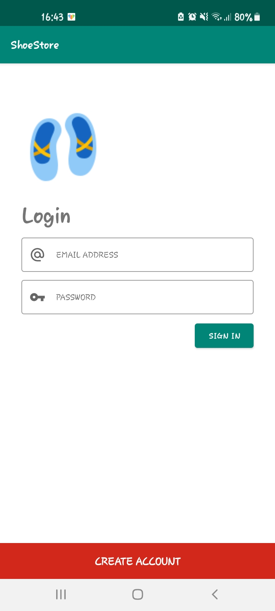
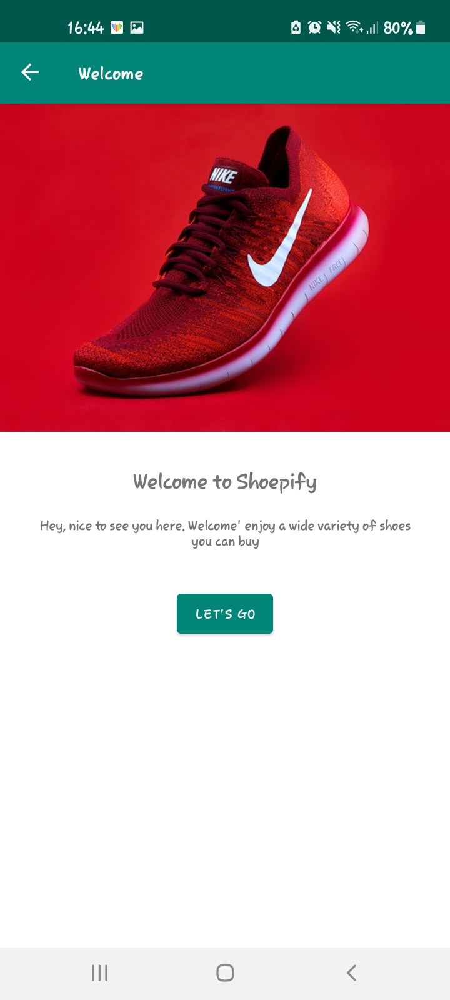
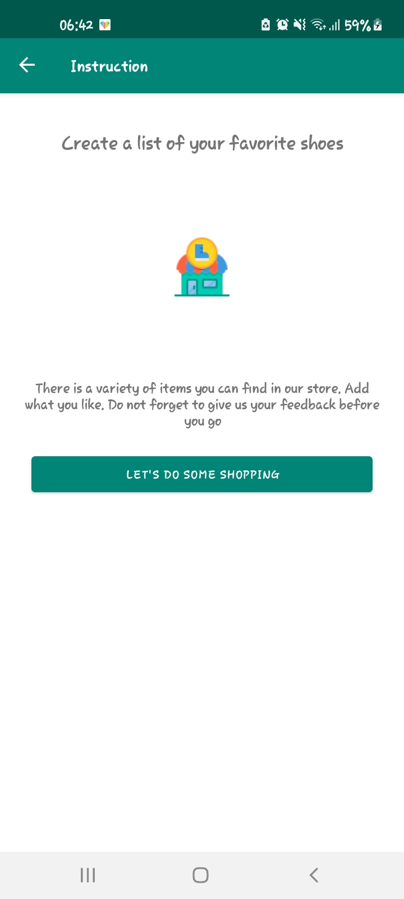
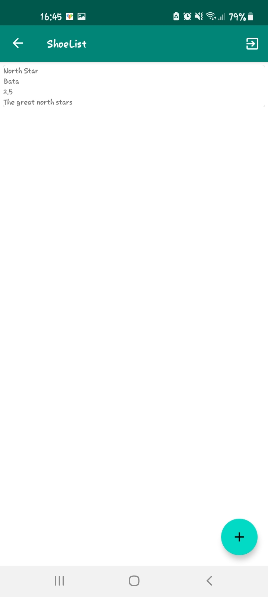
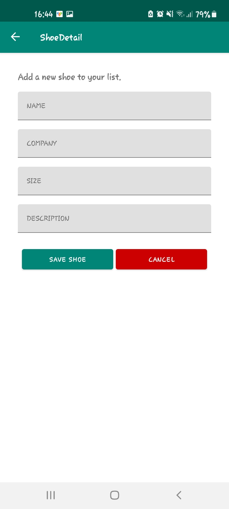

# ShoeStore

ShoeStore is an Android application that allows its users to create and store a list of shoes of their liking. The application contains a single activity with multiple fragments. The app is great practice for learning Android Layouts and Navigation Component from Jetpack.

## Built With
The application has been built with the following tools:

* [Kotlin](https://www.kotlinlang.org/)
* [Android Studio](https://www.developer.android.com/)
* [XML](https://en.wikipedia.org/wiki/XML)
* [Material Icons](https://fonts.google.com/icons)

The application utilized the Android Jetpack Components for its working. These components include:

* [Data Binding Library](https://developer.android.com/topic/libraries/data-binding)
* [Lifecycle Components](https://developer.android.com/topic/libraries/architecture/viewmodel)
* [Navigation Component](https://developer.android.com/guide/navigation)

# Getting Started
Feel like this is something that interests you, let us get you up and running.

## Prerequisites
In order to run this project you need to have the following installed:

* Java 1.8+ (Required to run Kotlin applications)

    [JDK Install](https://docs.oracle.com/en/java/javase/11/install/overview-jdk-installation.html#GUID-8677A77F-231A-40F7-98B9-1FD0B48C346A)

* Android Studio 4.0+

    [Download Android Studio](https://developer.android.com/studio?gclid=Cj0KCQiAw9qOBhC-ARIsAG-rdn7VX4kjwjz9K8jzhfx3e8zA05HB1xKz0LEcIaYrq8KCwyAHfpIOfl4aAjikEALw_wcB&gclsrc=aw.ds)

* Android Device (Physical or Emulator available on Android Studio)

## Installation

To install the application you will need to do the following:

* Clone the repository
    
        git clone https://github.com/otsembo/UND-Projects.git

* Launch Android Studio
* Open the project folder from android studio

        File > Open Project > Select ShoeStore

* Wait for the project to build and index.
* Run the project from the Android Studio menu

        Build > Run 'app'

NB: There is an alternative ```README_.md``` file that contains the requirements for this project.

# Usage

The application is simplistic and not to be used for production level. It is a simple approach to building lifecycle aware applications.

Check out some snaps of the application

 Login | Welcome | Instruction | ShoeList | ShoeDetail |
 ----- | ------- | ----------- | -------- | ---------- |
  |  |  |  |  |

